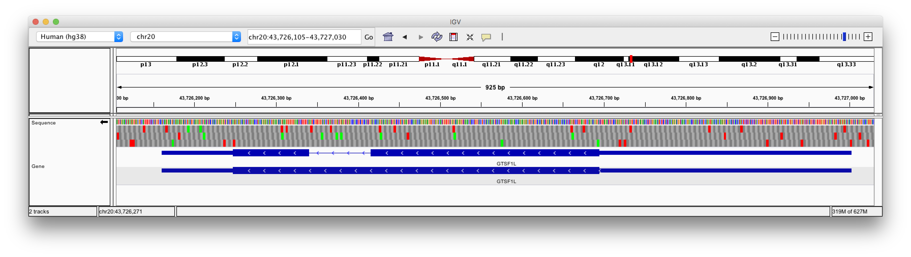

##


<br>

Bioconductor is repository for R packages relating to high-throughput biology (shotgun sequencing, microarrays, etc).

* Started in 2001, has developed alongside technology and growth of data

* Core set of types promotes interoperation<br>(Not just tidy data frames! Types have evolved over time to meet new needs.)

* Twice yearly release schedule

* Many contributors, but fairly good coding and documentation standards

## Flavours of R

### Base R

Functions and types that are always available in R.

### CRAN (17,264 packages as at March 2021)

"Comprehensive R Archive Network" - main source of R packages

```{r eval=F}
install.packages("glmnet")
install.packages("tidyverse")
```

### Bioconductor (1,974 packages as at March 2021)

```{r eval=F}
# Setup
install.packages("BiocManager")

# Install a Bioconductor package
BiocManager::install("limma")

# Check for out-of-date packages
BiocManager::install()
```


## What Bioconductor is for

**Genome and genome features: genes, regions, motifs, peaks, primers, SNPs** <span style="color: #00aaaa">&larr; focus for today</span>

eg for ChIP-seq, ATAC-seq, variant calling

* `Biostrings`, `GenomicRanges`, `GenomicFeatures`, `VariantAnnotation`, ...
<br>

**Differential testing of microarray, RNA-seq, and other high-throughput data**

* `SummarizedExperiment`, `limma`, `edgeR`, `DESeq2`, ...
* Further packages to normalize, impute, batch correct, check quality, ...
<br>

**Single-cell gene expression, etc**

* `SingleCellExperiment`, `scater`, `scran`, ...
* ["Orchestrating Single-Cell Analysis with Bioconductor" book](http://bioconductor.org/books/release/OSCA/)
<br>

**Visualization**

* `ComplexHeatmap`, `Gviz`, `ggbio`, `glimma`, ...
<br>

**Statistical methods for $p \gg n$ data**

...


## More types

Can do a lot in R with vectors and data frames.

Using Bioconductor will mean building familiarity with further types:
<br>
<br>

* `matrix`, `list`
<br>
<br>

* `DNAString`, `DNAStringSet`, `GRanges` <span style="color: #00aaaa">&larr; focus for today</span>
<br>
<br>

... `Seqinfo`, `TxDb`, `EnsDb`, `OrgDb`, `VCF`, `SummarizedExperiment`, `DelayedArray`, ...

## 

### ✋&nbsp;&nbsp;&nbsp;&nbsp;&nbsp;&nbsp;S3 types

Most base R packages use "S3" types. Data frames, tibbles, and linear model fits are examples of these.

* essentially lists
* if necessary, peek inside with `$`

<br>

### 👉👉&nbsp;&nbsp;S4 types

Bioconductor uses "S4" types, including it's own data frame (`DataFrame`) and list types (`SimpleList`, `GRangesList`, etc etc). If stuck, can almost always convert to base R types with `as.data.frame`, `as.list`, `as.character`, `as.numeric`.

* use accessor functions such as `seqnames`, `start`, `end`, `width`, `nchars`
* if absolutely necessary, peek inside with `@`

<br>
[Stuart Lee's guide to S4 for the perplexed](https://stuartlee.org/2019/07/09/s4-short-guide/)


##

(do workshop)


## Files in bioinformatics

| What|File types|R types|
| --- | --- | --- |
| DNA sequence | FASTA<sup>I</sup>, FASTQ, 2bit<sup>R</sup> | Biostrings::DNAStringSet, BSgenome<sup>R</sup>, rtracklayer::TwoBitFile<sup>R</sup> |
| Amino acid sequence | FASTA | Biostrings::AAStringSet |
| Genomic features | GTF<sup>I</sup>, GFF<sup>I</sup>, BED<sup>I</sup> | GenomicRanges::GRanges, GenomicFeatures::TxDb<sup>R</sup>, ensembldb::EnsDb<sup>R</sup> |
| Read alignments | SAM, BAM<sup>I</sup> | GenomicAlignments::GAlignments, Rsamtools::BamFile<sup>I</sup> |
| Numeric data along a genome | wiggle, bigWig<sup>R</sup> | list of numeric vectors, IRanges::RleList, rtracklayer::BigWigFile<sup>R</sup> |
| Variant calls | VCF<sup>I</sup> | VariantAnnotation::VCF |
| Numeric matrix (gene expression, etc) | CSV, TSV, HDF5<sup>R</sup> | matrix, HDF5Array<sup>R</sup>, DelayedArray<sup>R</sup>, SummarizedExperiment<sup>R</sup>, SingleCellExperiment<sup>R</sup>, ... |

(plus [many more](https://genome.ucsc.edu/FAQ/FAQformat.html))

&nbsp;`R` = random access to large files \
&nbsp;`I` = random access with an accompanying index file \
&nbsp;&nbsp;&nbsp;&nbsp;Prefer these file types!

`rtracklayer::import()` can read many file types.


## R indexing is 1-based

<div style="float: left; width: 40%">
**1-based** 

R, GFF and GTF feature files,<br>SAM alignment files, ...

```
   +---+---+---+---+---+---+
   | A | C | G | T | A | C |
   +---+---+---+---+---+---+
     1   2   3   4   5   6
             |       |
             |<----->|        
    
    seq[3] == "G"   seq[3:5] == "GTA"
```
</div>

<div style="float: right; width: 50%">
**0-based** 

Python, C,<br>BED feature files, ...

```
   +---+---+---+---+---+---+
   | A | C | G | T | A | C |
   +---+---+---+---+---+---+
   0   1   2   3   4   5   6
           |           |
           |<--------->|      

   seq[2] == "G"    seq[2:5] == "GTA"
```
</div>

<div style="clear: both"></div>

<br>

Bioconductor file import functions will convert all data to 1-based.

Need to do own conversion if using `read.table()`, etc.

## Reference genomes and annotations

"High-throughput" biological data analysis usually occurs in the context of:

<br>

* **a genome assembly** <span style="color: #00aaaa">&larr; Updated infrequently. RefSeq, Ensembl, UCSC all use same sequences.</span>

* **gene and transcript annotations** <span style="color: #00aaaa">&larr; Updated frequently. Different between RefSeq, Ensembl, UCSC.</span>

<br>

Main sources for model organisms:

* <span style="font-size: 200%">🇺🇸</span> The NCBI's [RefSeq](https://www.ncbi.nlm.nih.gov/refseq/)
* <span style="font-size: 200%">🇪🇺</span> The EBI's [Ensembl genome browser](https://ensembl.org/)
* <span style="font-size: 200%"></span>The [UCSC genome browser](https://genome.ucsc.edu/cgi-bin/hgGateway)

<span class="tip">...<span class="tiptext">
UCSC was the original web-based genome browser. UCSC's "KnownGene" gene annotations used to be the cutting edge gene annotation source, but UCSC now relies on other sources for gene annotations. Many file types that remain important today were developed for the UCSC genome browser, such as "bed", "bigWig", and "2bit".
<br><br>
Genome assemblies are released infrequently. GRCh38 (hg38) was released in 2013. The previous assembly, GRCh37 (hg19) was released in 2009. Some people haven't updated yet, you will find plenty of data using "hg19" positions! Gene and transcript annotations are updated far more frequently.
<br><br>
As well as the chromosomes in the "primary assembly" a genome assembly may have further sequences, which may have been added after the initial release:
<br><br>
&nbsp;• patch sequences: fixes that would change the sizes of chromosomes<br>
&nbsp;• alt loci: a way to represent alleles, genetic diversity in the species
</span></span>

## Genome browsers

On the web:

* [UCSC](https://genome.ucsc.edu/cgi-bin/hgTracks?db=hg19&lastVirtModeType=default&lastVirtModeExtraState=&virtModeType=default&virtMode=0&nonVirtPosition=&position=chr13%3A32868568%2D32994857&hgsid=1052205095_AaqJoeemFT7StcNxT3Cxn3TgBT0N)
* [Ensembl](https://asia.ensembl.org/Homo_sapiens/Location/View?db=core;g=ENSG00000139618;r=13:32313383-32401971)

On your desktop:

* [Integrative Genomics Viewer](https://software.broadinstitute.org/software/igv/)
    * Can view many file types. 
    * View very large files such as [BAM](https://samtools.github.io/hts-specs/) or [bigWig](https://genome.ucsc.edu/goldenPath/help/bigWig.html).




## Command-line bioinformatics software

Not all bioinformatics software is an R package!

R's role will often be to massage your data into the form needed for command line tools, or to examine a tool's output.

<br>

One way to install command-line software is using the Conda package manager:

* [Install miniconda](https://docs.conda.io/projects/conda/en/latest/user-guide/install/)
* Use the [bioconda](https://anaconda.org/bioconda) channel

```
# Example
conda install -c bioconda meme
```

* Can be used on your own computer, or on a server or cluster.
* Doesn't need admin rights.


##

(continue workshop)


## Using Bioconductor

1. Find some useful packages
1. Read the vignettes
1. Read the reference documentation for specific functions you need
1. If you run into a funny class, check its documentation, work out the accessor functions, and in a pinch poke around its internals with `@` or try `as.data.frame`.

```{r eval=F}
?"GRanges-class"

methods(class="GRanges")
```

<br>

* The [Bioconductor website](https://bioconductor.org) includes material from many and various tutorials/vignettes/workflows
* [Most downloaded Bioconctor packages](http://bioconductor.org/packages/stats/)
* [Mike Love's Bioconductor cheat sheet](https://github.com/mikelove/bioc-refcard/blob/master/README.Rmd)
* [plyranges](https://bioconductor.org/packages/release/bioc/html/plyranges.html) provides a "tidy" way of working with GRanges with many powerful features, developed by Dr. Stuart Lee at Monash. [A plyranges workshop](https://bioconductor.github.io/BiocWorkshops/fluent-genomic-data-analysis-with-plyranges.html)
* [Bioconductor's Stack-Overflow-style support site](https://support.bioconductor.org/)


